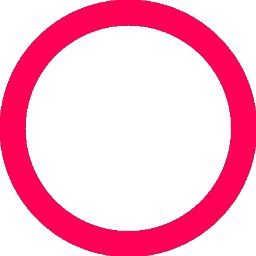

# Icon Generation Server

Express-based API server for generating icons using Ollama AI with automatic color customization and image processing.

## Features

- 🎨 Generate icons using Ollama AI (x/flux2-klein:4b model)
- 🎨 Apply custom colors to generated icons
- 🗄️ Intelligent caching (MD5-based)
- ✂️ Auto-crop and resize (256x256)
- ⚡ High contrast processing for crisp outlines

## Requirements

- **Node.js** 18+
- **Ollama** with model `x/flux2-klein:4b`

```bash
# Install Ollama (macOS)
brew install ollama

# Install Ollama (Linux)
curl -fsSL https://ollama.com/install.sh | sh

# Pull the model
ollama pull x/flux2-klein:4b
```

## Installation

```bash
npm install
```

## Running the Server

```bash
# Development (with hot-reload)
npm run dev

# Production
npm run build
npm start
```

**Or use PM2:**
```bash
pm2 start ecosystem.config.js
```

The server starts on port **3000** by default. Change with: `PORT=8080 npm start`

## API Endpoints

### POST /icon

Generate a new icon.

**Request:**
```json
{
  "prompt": "neon star",
  "color": "#FF0055"
}
```

| Field | Type   | Description                          |
|-------|--------|--------------------------------------|
| prompt| string | Text prompt for icon generation      |
| color | string | Hex color code (#RRGGBB or RRGGBB)   |

**Response (200):**
```json
{
  "success": true,
  "cacheKey": "a1b2c3d4e5f6...",
  "image": "data:image/png;base64,..."
}
```

**Response (400):**
```json
{
  "error": "Missing required fields: prompt and color are required"
}
```

### GET /health

Health check endpoint.

```bash
curl http://localhost:3000/health
```

**Response:**
```json
{
  "status": "ok",
  "timestamp": "2026-06-21T16:30:00.000Z"
}
```

### GET /icons

List cached icons.

```bash
curl http://localhost:3000/icons
```

**Response:**
```json
{
  "count": 5,
  "files": ["a1b2c3d4.png", "e5f6g7h8.png"]
}
```

## Usage Examples

### cURL

```bash
# Red robot head
curl -X POST http://localhost:3000/icon \
  -H "Content-Type: application/json" \
  -d '{"prompt": "robot head", "color": "#FF0000"}'

# Blue star
curl -X POST http://localhost:3000/icon \
  -H "Content-Type: application/json" \
  -d '{"prompt": "star", "color": "#3498db"}'

# Neon green turtle
curl -X POST http://localhost:3000/icon \
  -H "Content-Type: application/json" \
  -d '{"prompt": "turtle", "color": "#27ae60"}'
```

### JavaScript / Fetch

```javascript
const generateIcon = async (prompt, color) => {
  const response = await fetch('http://localhost:3000/icon', {
    method: 'POST',
    headers: { 'Content-Type': 'application/json' },
    body: JSON.stringify({ prompt, color })
  });
  
  const { success, cacheKey, image } = await response.json();
  
  if (success) {
    // Display in  tag
    document.querySelector('#icon').src = image;
    // Or save to file
    const link = document.createElement('a');
    link.download = `${cacheKey}.png`;
    link.href = image;
    link.click();
  }
};

generateIcon('neon star', '#FF0055');
```

### Python

```python
import requests
import base64

response = requests.post('http://localhost:3000/icon', json={
    'prompt': 'neon star',
    'color': '#FF0055'
})

data = response.json()
if data['success']:
    # Decode base64 and save
    img_data = base64.b64decode(data['image'].split(',')[1])
    with open('icon.png', 'wb') as f:
        f.write(img_data)
```

## How It Works

1. **Cache Check** - Request is checked against MD5(prompt:color)
2. **Generate** - If cache miss, calls Ollama:
   ```
   ollama run x/flux2-klein:4b '{"icon":true,"style":"minimalistic","info":"<prompt>"}'
   ```
3. **Process** - Greyscale → Contrast boost → Crop to content → Resize 256x256
4. **Color** - Apply user's color to dark areas, preserve white background
5. **Cache** - Save to `icons/{cacheKey}.png`

## Example Output

Generated icon: `icons/example-icon.png`



## Project Structure

```
iconGenerationServer/
├── src/
│   ├── server.ts        # Express server & API endpoints
│   ├── processImage.ts  # Image processing (greyscale, contrast, crop, resize)
│   └── const.ts         # Constants (WIDTH, HEIGHT)
├── icons/               # Icon cache directory
├── dist/                # Compiled JavaScript
├── ecosystem.config.js  # PM2 configuration
├── package.json
└── tsconfig.json
```

## License

Apache License 2.0